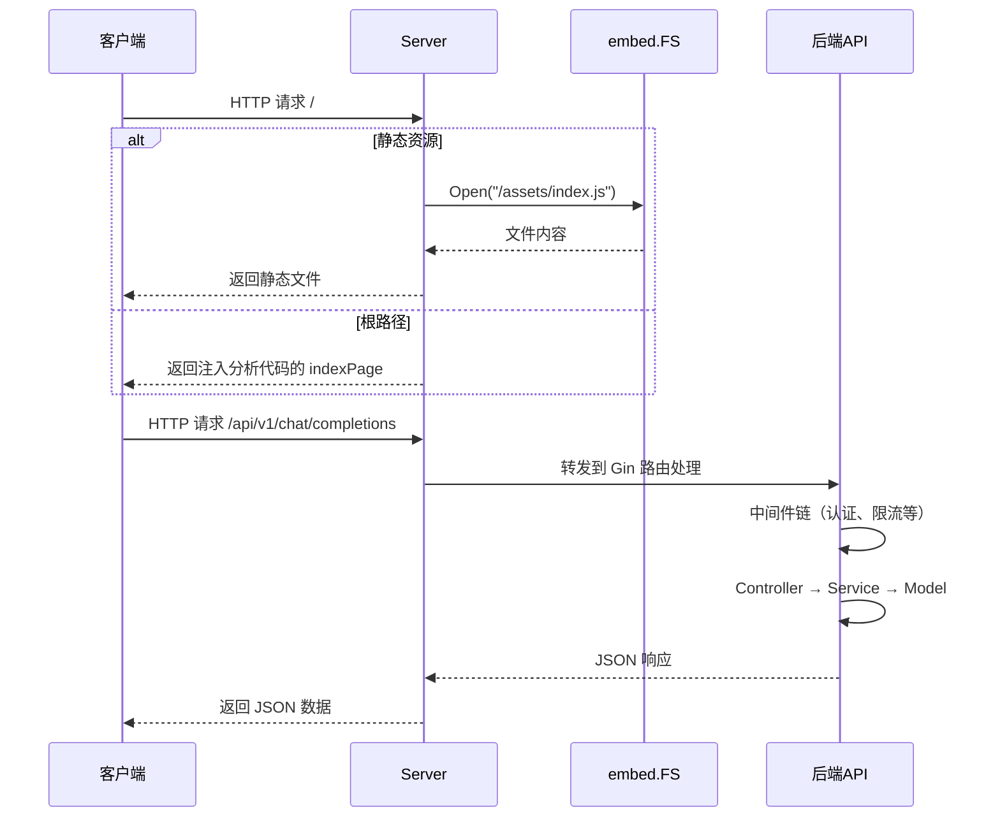

# 前后端集成机制

## 概述

new-api 采用 **单二进制部署**架构，前端 React 构建产物通过 Go 的 `embed` 功能直接嵌入到后端可执行文件中。这种设计实现了：

- **单文件部署** - 只需分发一个 `new-api` 可执行文件
- **简化运维** - 无需单独部署前端静态资源
- **生产优化** - 避免文件系统 I/O 开销

## 技术实现

### 1. Go Embed 功能

Go 1.16+ 引入了 `embed` 指令，可以在编译时将文件或目录嵌入到二进制文件中。

在 `main.go` 中的实现：

```go
//go:embed web/dist
var buildFS embed.FS

//go:embed web/dist/index.html
var indexPage []byte
```

**说明：**
- `go:embed web/dist` - 嵌入整个前端构建目录
- `go:embed web/dist/index.html` - 单独嵌入 index.html（用于动态注入分析代码）

### 2. 路由配置

路由通过 `router.SetRouter()` 配置：

```go
// main.go 第 186 行
router.SetRouter(server, buildFS, indexPage)
```

在 `router/web-router.go` 中：

```go
func SetWebRouter(router *gin.Engine, buildFS embed.FS, indexPage []byte) {
    // 使用嵌入的文件系统服务静态文件
    router.Use(static.Serve("/", common.EmbedFolder(buildFS, "web/dist")))
}
```

### 3. 自定义文件系统

`common/embed-file-system.go` 实现了 `static.ServeFileSystem` 接口：

```go
type embedFileSystem struct {
    http.FileSystem
}

func EmbedFolder(fsEmbed embed.FS, targetPath string) static.ServeFileSystem {
    efs, err := fs.Sub(fsEmbed, targetPath)
    if err != nil {
        panic(err)
    }
    return &embedFileSystem{
        FileSystem: http.FS(efs),
    }
}
```

**特殊处理：**
- 根路径 `/` 返回 `os.ErrNotExist`，让路由器处理 index.html
- 其他路径从嵌入的文件系统读取

### 4. 动态注入分析代码

为了支持 Google Analytics 和 Umami 等分析工具，`indexPage` 会被动态修改：

```go
// InjectUmamiAnalytics
func InjectUmamiAnalytics() {
    if os.Getenv("UMAMI_WEBSITE_ID") != "" {
        // 将分析代码注入到 indexPage
        indexPage = bytes.ReplaceAll(indexPage,
            []byte("<!--umami-->\n"),
            []byte(analyticsInject))
    }
}

// InjectGoogleAnalytics
func InjectGoogleAnalytics() {
    if os.Getenv("GOOGLE_ANALYTICS_ID") != "" {
        // 注入 Google Analytics 代码
        indexPage = bytes.ReplaceAll(indexPage,
            []byte("<!--Google Analytics-->\n"),
            []byte(analyticsInject))
    }
}
```

## 运行时架构

```mermaid
graph TB
    subgraph "编译时"
        CMD[go build]
        EMBED1["//go:embed web/dist"]
        EMBED2["//go:embed web/dist/index.html"]
        BINARY[new-api 可执行文件]
    end

    subgraph "运行时"
        CLIENT[浏览器访问]
        SERVER[new-api 服务器]

        subgraph "嵌入的文件系统"
            FS[buildFS embed.FS]
            HTML[index.html]
            ASSETS["assets/*.js, *.css"]
        end

        subgraph "路由处理"
            STATIC["静态文件服务<br/>/"]
            API["API 路由<br/>/api/*", "/v1/*"]
        end
    end

    CMD --> EMBED1
    CMD --> EMBED2
    EMBED1 --> BINARY
    EMBED2 --> BINARY
    BINARY --> SERVER
    FS --> STATIC
    HTML --> STATIC
    ASSETS --> STATIC
    CLIENT --> SERVER
    SERVER --> CLIENT

    style BINARY fill:#e1f5e3,stroke:#c53077,stroke-width:3px
    style FS fill:#f9f1eb,stroke:#7b68ee
    style HTML fill:#fffbeb,stroke:#594f33
    style ASSETS fill:#fef3c7,stroke:#d97706
```

## 请求处理流程



## 路径映射

| 客户端请求 | 服务来源 | 说明 |
|------------|----------|------|
| `/` | `embedFS` (index.html) | 返回首页 |
| `/assets/*` | `embedFS` | 前端静态资源 |
| `/api/*` | Gin Router | 管理后台 API |
| `/v1/*` | Gin Router | 兼容 One API 格式 |
| `/dashboard/*` | Gin Router | 数据看板 |
| `/pg/*` | Gin Router | Playground |
| `/mj/*` | Gin Router | Midjourney 代理 |
| `/webhook/*` | Gin Router | 回调处理 |

## 开发模式

### 前后端分离开发

在本地开发时，可以分别运行前后端：

```bash
# 终端 1: 前端开发服务器（支持热重载）
cd web && npm run dev
# 运行在 http://localhost:5173

# 终端 2: 后端 API 服务器
go run main.go
# 运行在 http://localhost:3000

# 前端通过 Vite 代理访问后端 API
```

**Vite 配置**（`web/vite.config.js`）：

```javascript
server: {
  proxy: {
    '/api': { target: 'http://localhost:3000', changeOrigin: true },
    '/mj': { target: 'http://localhost:3000', changeOrigin: true },
    '/pg': { target: 'http://localhost:3000', changeOrigin: true },
  }
}
```

### 生产构建

使用 Makefile 或手动构建：

```bash
# 使用 makefile
make build-frontend

# 或手动
cd web && npm run build
go build -o bin/new-api
```

构建后，`web/dist/` 的所有内容被嵌入到二进制中。

## 优缺点对比

### 单二进制部署（当前方案）

**优点：**
- ✅ 部署简单，单个可执行文件
- ✅ 无需 Web 服务器（Nginx/Apache）配置
- ✅ 文件访问更快（内存读取 vs 磁盘）
- ✅ 版本一致性强（前后端版本始终同步）
- ✅ 适合容器化部署

**缺点：**
- ❌ 更新前端需要重新编译整个后端
- ❌ 二进制文件较大（包含所有前端资源）
- ❌ 无法单独部署 CDN 加速前端资源

### 前后端分离部署

**优点：**
- ✅ 前后端可独立更新
- ✅ 前端可部署到 CDN
- ✅ 二进制文件更小
- ✅ 前端开发更便捷（热重载）

**缺点：**
- ❌ 部署复杂（需要配置 Web 服务器）
- ❌ 版本管理更复杂（需要确保前后端版本匹配）
- ❌ 需要处理跨域等额外配置

## 相关文件

| 文件路径 | 作用 |
|----------|------|
| `main.go` | 定义 `//go:embed` 指令，注入分析代码 |
| `router/web-router.go` | 配置静态文件路由 |
| `common/embed-file-system.go` | 实现 `static.ServeFileSystem` 接口 |
| `web/dist/` | 前端构建产物目录（嵌入源） |
| `web/vite.config.js` | 前端开发服务器配置，包含 API 代理 |

## 环境变量

以下环境变量影响前端行为：

| 环境变量 | 说明 |
|-----------|------|
| `UMAMI_WEBSITE_ID` | Umami 网站 ID，启用 Umami 分析 |
| `UMAMI_SCRIPT_URL` | Umami 脚本 URL（默认官方地址） |
| `GOOGLE_ANALYTICS_ID` | Google Analytics 测量 ID，启用 GA 分析 |
| `FRONTEND_BASE_URL` | 前端基础 URL（某些场景使用） |

## 总结

new-api 的前後端集成机制是一个精心设计的单文件部署方案，利用 Go 1.16+ 的 `embed` 功能将前端资源无缝集成到后端服务中。这种设计特别适合：

- 容器化部署（Docker）
- 简化运维场景
- 需要快速部署的场景

开发者可以根据需求选择单文件部署或前后端分离开发。
